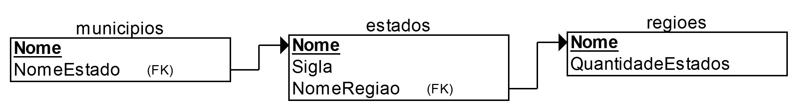

### Tarefa I - SIEGE (Sistema Inteligente de Ensino de Geografia)
> 18/08/2017 ⇒ 12/09/2017

----------------------------------------

**Curso:** Ciência da Computação <br>
**Professor:** José Francisco Netto <br>
**Aluno:** Micael Levi -- 21554923 <br>

----------------------------------------


## [SIEGE-telegram-bot/src/controllers/prolog/database](SIEGE-telegram-bot/src/controllers/prolog/database)

Os fatos disponíveis nos programas dispostos neste diretório são:
> - `regiao(?Nome, ?QuantidadeEstados)`
> - `estado(?Nome, ?Sigla, ?NomeRegiao)`
> - `municipio(?Nome, ?NomeEstado)`

Pensando nos fatos em termos de tabela, as relações de integridade referencial foram definidas da seguinte forma:



# TODO
<!-- https://pt.wikipedia.org/wiki/Geografia_do_Brasil -->

## 5 temas escolhidos e possíveis perguntas:
<!-- API para estados do Brasil
https://servicodados.ibge.gov.br/api/docs/localidades
http://www.geonames.org/export/place-hierarchy.html

http://www.geonames.org/childrenJSON?geonameId=3469034
{
"totalResultsCount": 27,
"geonames": [
    {
        "adminCode1": "01",
        "lng": "-70",
        "geonameId": 3665474,
        "toponymName": "Acre",
        "countryId": "3469034",
        "fcl": "A",
        "population": 732793,
        "numberOfChildren": 22,
        "countryCode": "BR",
        "name": "Acre",
        "fclName": "country, state, region,...",
        "countryName": "Brazil",
        "fcodeName": "first-order administrative division",
        "adminName1": "Acre",
        "lat": "-9",
        "fcode": "ADM1"
    }
  ]
}
-->

<!-- http://www.suapesquisa.com/geografia/estados_capitais_brasil.htm -->
1. [ ] *Capitais dos Estados do Brasil*
	- Quais são as capitais do país
	- Quantas capitais o país tem
	- Qual a capital de um estado
	- Quantos habitantes cada capital possui

<!-- https://pt.wikipedia.org/wiki/Lista_de_bandeiras_do_Brasil -->
2. [ ] *Estados e Regiões do Brasil* (Brasil Político)
	- Quais as regiões do país
	- Quantas regiões o país tem
	- Qual a capital de cada região
	- Qual a bandeira de um estado

<!-- https://pt.wikipedia.org/wiki/Lista_de_estados_fronteiri%C3%A7os_do_Brasil -->
<!-- https://pt.wikipedia.org/wiki/Lista_de_pa%C3%ADses_lim%C3%ADtrofes_do_Brasil -->
<!-- http://www.suapesquisa.com/geografia/estados_capitais_brasil.htm -->
3. [ ] *Limites e Fronteiras dos Estados do Brasil*
	- Quais cidades realizam fronteiras com quais países e em qual km
	- Quais estados realizam fronteiras com quais países
	- Quais regiões realizam fronteiras

4. [ ]

5. [ ]


# Perguntas que serão respondidas <!-- implementar!! -->
1.  [ ] Qual é a capital de `Estado`?
2.  [ ] `Municipio` é a capital de qual estado?
3.  [ ] `Municipio` é a capital de `Estado`?
4.  [ ] `Municipio` é a capital de algum estado?
5.  [ ] Existe algum estado cuja capital tem o mesmo nome do estado?
6.  [ ] Quantos estados tem o Brasil?
7.  [ ] O estado _do_/_de_ `Estado` fica na região `Regiao`?
8.  [ ] Quais são os estados que compõem a região `Regiao`?
9.  [ ] `Estado` fica em qual região?
10. [ ] Que estados fazem fronteira com o estado `Estado`?
11. [ ] Qual é o estado que faz fronteira com mais estados?
12. [ ] Qual é o estado que faz fronteira com menos estados?
13. [ ] Existe algum estado que faz fronteira com apenas um estado?
14. [ ] Quais são os estados que são banhados pelo mar?
15. [ ] Quais são as capitais brasileiras que ficam em ilhas?
16. [ ] Descreva um caminho rodoviário entre o estado do `Estado1` e `Estado2`, sem sair das fronteiras do Brasil.
17. [ ] Qual é a população do `Estado`?
18. [ ] Qual é a população da região `Regiao`?
19. [ ] Qual é o estado com maior população?
20. [ ] Qual é o estado com menor população?
21. [ ] Qual é a população do `Municipio`?


<!--
# Descrição da Tarefa

O objetivo é criar um sistema programado em `Prolog` que auxilie o ensino e aprendizagem de Geografia do Brasil. <br>
Devendo abranger, pelo menos, 5 tópicos. <br>
A interface pode ser feita empregando-se `XPCE/Prolog` ou outra linguagem.


# Documentação
www.swi-prolog.org/pldoc/

## Predicados

```
argumento de entrada: +
argumento de saída: -
argumento de entrada/saída: ?
```

- **length**(_?List, ?Int_) <br>
`True` if Int represents the number of elements in List. <br>
This predicate is a true relation and can be used to find the length of a list or produce a list (holding variables) of length Int. <br>
The predicate is non-deterministic, producing lists of increasing length if List is a partial list and Int is unbound. <br>
This predicate fails if the tail of List is equivalent to Int. <br>
It raises errors if:
  - Int is bound to a non-integer.
  - Int is a negative integer.
  - List is neither a list nor a partial list. This error condition includes cyclic lists.


# Como Usar

## Instalação

### Exemplo de Uso

-->

## License
MIT: http://micalevisk.mit-license.org/
